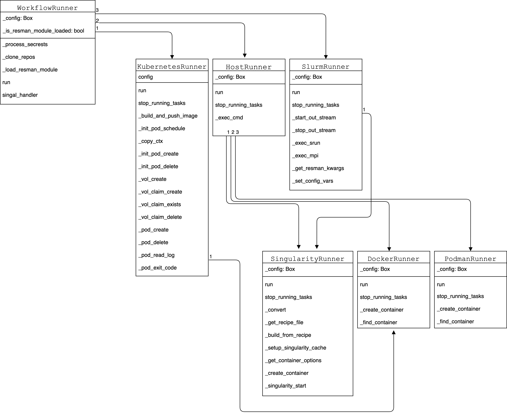

# Keywords: Reproducibility, SciOps, Docker

# Overview {#sec:overview}

## Introduction {#sec:intro}

Nearly 48.6% of scientists and researchers working in various domains of computational science, upload experimental artifacts like code, figures, datasets, configuration files, etc. on open-access repositories like Zenodo [@_zenodo_], Figshare [@_figshare_] or GitHub [@github]. 
Unfortunately, only 1.1% of the artifacts available online are fully reproducible and 0.6% of them are partially reproducible [@stagge2019assessing]. 
This problem occurs mostly due to the lack of proper documentation, missing artifacts, broken software dependencies, etc. 
Scientific workflow engines like Nextflow, Pegasus, and Taverna which are well-known have been a predominant solution [@stevens2013automated] [@banati2015minimal] for handling the reproducibility problem by organizing the steps of a complex scientific workflow as the nodes of a directed acyclic graph (DAG) and executing them in the correct order [@albrecht2012makeflow].

One of the primary reasons behind this problem is the disparity in the environment where the workflows are developed and where they are reproduced [@meng2017facilitating]. 
Virtual Machines (VMs) were used to address this problem for some time due to their high isolation and environmental consistency guarantees, where every step of a workflow ran inside a separate VM [@howe2012virtual] [@virtandnestedvirt2012].
Since VM's had large resource footprints, researchers replaced VM's with software containers, i.e. light-weight virtualization technologies to provide platform-independent reproducibility [@barik2016performance] [@sharma2016containers].
Although software (Linux) containers are a relatively old technology [@menage_adding_2007], it was not until recently, with the rise of Docker, that they entered mainstream territory [@bernstein_containers_2014]. 
Since then, this technology has transformed the way applications get deployed in shared infrastructures, with 25% of companies using this form of software deployment [@datadog_surprising_2018], and a market size projected to be close to 5B by 2023 [@marketsandmarkets_application_2018]. 
Docker has been the de facto container runtime, with other container runtimes such as Singularity [@kurtzer_singularity_2017], Rkt [@rktcommunity_rkt_2019], Charliecloud [@priedhorsky_charliecloud_2017], and Podman [@podmancommunity_containers_2019] having emerged. 

With Docker, the container-native software development paradigm emerged, which promotes the building, testing, and deployment of software in containers, so that users do not need to install and maintain packages on their machines, rather they can build or fetch container images which have all the dependencies present. 
Since these container runtimes are available for almost every well known operating system and architecture, experiments can be reproduced easily using containerized workflows in almost any environment [@stubbs2016endofday] [@zheng_integrating_2015].
Although there are different container engines available, switching between them is often difficult as they have different API's, image formats, CLI interfaces, among many others.
Also, there is an absence of tools that allow running containerized workflows in an engine agnostic way.
It has also been found that as scientific workflows become increasingly complex, continuous validation of the workflows which is critical to ensuring good reproducibility, becomes difficult [@deelman2018future] [@cohen2017scientific].
Currently, different container-based workflow engines are available but all of them assume the presence of a fully provisioned Kubernetes [@kubernetes_google] cluster.
The difference between cloud-native and container-native is that, in the former, a Kubernetes cluster is required, while in the latter, only a container engine is required.
Argo [@argocommunity_argoproj_2019], Pachyderm [@novella_containerbased_2018], and Brigade [@brigade] are popular examples of cloud-native workflow execution engines.
It would be more convenient for researchers if workflow engines provide the flexibility of running workflows in a wide range of computing environments including those of their choice. 

Popper [@systemslabpopper] is a light-weight workflow execution engine that allows users to follow the container-native paradigm for building reproducible workflows from archived experimental artifacts. 
This paper makes the following contributions:

1. The design and architecture of a container-native workflow engine that abstracts multiple resource managers and container engines giving users the ability to focus only on Dockerfiles, i.e. software dependencies and workflow logic, i.e. correct order of execution, and ignore the runtime specific details.
   This arrangement also provides built-in support for continuous validation and portability of workflows which empowers researchers to develop workflows once and run interchangeably between CI services like Travis, Jenkins, etc. and the local machine without any modifications. 

2. Popper CLI, an implementation of the above design that allows running workflows inside containers in different computing environments like local machines, Kubernetes clusters, or HPC [@yang2005high] environments.


## Implementation and Architecture

{#fig:arch}

### Workflow Definition Language

YAML [@ben2009yaml] is a human-readable data-serialization language. 
It is primarily used in writing configuration files and in applications where data is stored or transmitted. 
Due to its simplicity and wide adoption [@yaml_wide_adoption], we chose YAML for defining popper workflows and for specifying the configuration for the execution engine. 
Another reason for adopting YAML as our workflow definition language was the availability of stable YAML parsers like PyYAML.
An example popper workflow definition is shown below.

```yml
steps:
- id: download-data
  uses: docker://byrnedo/alpine-curl:0.1.8
  args: [
    "--create-dirs",
    "-Lo data/global.csv",
    "https://github.com/datasets/co2-fossil-global/raw/master/global.csv"
  ]

- id: run-analysis
  uses: docker://python:alpine
  args: [
    "scripts/get_mean_by_group.py",
    "data/global.csv", "5"
  ]

- id: validate-results
  uses: docker://python:alpine
  args: [
    "scripts/validate_output.py",
    "data/global_per_capita_mean.csv"
  ]
```

A popper workflow consists of a series of syntactical elements called steps, where each step represents a node in the workflow DAG, with a `uses` attribute specifying the required container image. 
The `uses` attribute can reference Docker images hosted in container image registries; filesystem paths for locally defined container images (Dockerfiles); or publicly accessible GitHub repositories that contain Dockerfiles. 
The commands or scripts that need to be executed inside a container can be defined by the `args` and `runs` attributes. 
Popper also supports running steps interactively, like for example running a Jupyter Notebook.
Secrets and environment variables needed by a step can be specified through the `secrets` and `env` attributes respectively for making them available inside the container associated with a step.
The steps in a workflow are executed sequentially in the order in which they are defined.
A global `options` attribute is also available which can be used to define workflow engine options that are common to all the steps.
An exporter module for Popper is being planned currently which would enable users to export Popper workflows in vanilla YAML to formats like Python code or CWL that are recognized by other well-known workflow engines like Apache Airflow, etc.

### Workflow Execution Engine

The Popper workflow execution engine is composed of several components that talk to each other during workflow execution.
The vital architectural components of the system are described in detail throughout this section.
The architecture of the Popper workflow engine is shown in @Fig:arch;

#### Command Line Interface (CLI)

{#fig:casestudy}

Besides allowing users to communicate with the workflow runner, the CLI allows visualizing workflows by generating DOT diagrams [@dot] like the one shown in @Fig:casestudy;
generates configuration files for continuous integration systems, e.g. TravisCI, Jenkins, Gitlab-CI, etc. so that users can continuously validate their workflows;
provides dynamic workflow variable substitution capabilities, among others.
The CLI interface is built using Click which is a Python package for creating command-line interfaces in a composable way with as little code as necessary.
The CLI functionalities are defined in the `PopperCLI` abstraction within the `popper.cli` module.
Popper also provides an interface for providing a configuration file that contains container and resource manager specific options.

#### Workflow Definition and Configuration Parsers

The workflow file and the configuration file are parsed by their respective parser plugins at the initial stages of the workflow execution.
The parsers are responsible for reading and parsing the YML files into an internal format;
running syntactic and semantic validation checks;
normalizing the various attributes and generating a workflow DAG.
The workflow parser has a pluggable architecture that allows adding support to other workflow languages.
The parser interface consists of a `WorkflowParser` class in the `popper.parser` module.
The parser module uses the pykwalify package to validate a `dict` based on a predefined schema.
The `WorkflowParser` has methods like `__apply_substitutions`, `__skip_steps`, `__filter_steps` that provide functionalities to manipulate workflows in different ways.
The parser takes an input of a file and other metadata containing information on how to reshape the workflow data (if required) and gives out a Python Box, which is an immutable data container for dot notation access.

#### Workflow Runner

{#fig:class}

The Workflow runner is in charge of taking a parsed workflow representation as input and executing it.
It is defined as the `WorkflowRunner` class in the `popper.runner` module.
It also downloads actions referenced by the steps in a workflow, checks the presence of secret variables that are required by a workflow, dynamically loads the resource manager module and starts the execution of a step using the configured container engine.
The runner also maintains a cache directory following the XDG specifications to optimize multiple aspects of execution such as avoid cloning repositories unnecessarily, avoid re-building already built images. 
Thus, the workflow runner module drives the entire workflow execution. 
The UML class diagram for the workflow runner module is shown in @Fig:class;

#### Resource Manager and Container Engine Interface

Popper supports running containers in both single-node and multi-node cluster environments. 
The resource manager API is a pluggable interface that allows the creation of plugins (also referred to as runners) for distinct job schedulers (e.g. SLURM, SGE, HTCondor, etc.) and cluster managers (e.g. Kubernetes, Mesos, YARN, etc.). 
Currently, plugins for SLURM and Kubernetes exist, as well as the default Host runner that executes workflows on the host machine where Popper is executed.
Resource manager plugins provide abstractions for different container engines which allows a particular resource manager to support new container engines through plugins.
For example, in the case of SLURM, it currently supports running Singularity containers but other container engines can also be integrated like Charliecloud [@charliecloud] and Pyxis [@pyxis].
The container engine plugins abstract generic operations that all engines support such as creating an image from a `Dockerfile`;
downloading images from a registry and converting them to their internal format;
and container-level operations such as creation, deletion, renaming, etc.
Currently, there are plugins for Docker, Singularity, and Podman, with others planned by the Popper community.

The behavior of a resource manager and a container engine can be customized by passing specific options through the configuration file enabling the users to take advantage of engine and resource manager specific features in a transparent way.
In the presence of a `Dockerfile` and a workflow file, a workflow can be reproduced easily in different computing environments only by tweaking the configuration file.
For example, a workflow developed on the local machine can be run on a Slurm cluster using Singularity containers by specifying the job options in the configuration file.
The configuration file can be created by users or provided by system administrators and can be passed through the CLI interface.

The resource manager interface of Popper has 3 parent classes i) `HostRunner`, contains common methods for building and running containers on the local machine.
ii) `SlurmRunner`, contains methods for pulling and running containers in Slurm clusters, and iii) `KubernetesRunner`, contains methods for creating and managing `PeristentVolume`, `PersistentVolumeClaim`, and `Pod` in Kubernetes clusters.
Each resource manager class is subclassed by the container engine specific subclasses and add the container-specific functionalities.
For example, the `DockerRunner` inherits from the `HostRunner` class. Another implementation of the `DockerRunner` inherits from the `KubernetesRunner` for running containers in Kubernetes.

#### Continuous Integration

Popper allows users to continuously validate their workflows by allowing them to export workflows as CI pipelines for different continuous integration services like TravisCI, Circle, Jenkins, Gitlab-CI, etc.
The CLI provides a `popper ci` sub-command that can be used to generate configuration files for different CI services.
To set up CI for a project using Popper, it is required to generate a CI configuration file, push the project to Github and enable the repository on the CI provider.
Using CI with Popper workflows enhances the reproducibility guarantees as continuous validation helps to keep a check on various breaking changes like outdated dependencies, broken links, deleted docker images, etc.
Another benefit of using CI with Popper is that even without changes, jobs can be configured so that they run periodically (e.g. once a week), to ensure that they are in a healthy state.
An example of a Travis configuration file generated by Popper is shown below.

```yaml
---
dist: xenial
language: python
python: 3.7
services: docker
install:
- git clone https://github.com/systemslab/popper /tmp/popper
- export PYTHONUNBUFFERED=1
- pip install /tmp/popper/cli
script: popper run -f .popper.yml
```

## Quality Control

The tool has been unit tested using the `unittest` library from the Python standard library. 
Several plugins like the Slurm Runner has been unit tested by mocking the methods using the `unittest.mock` module which couldn't otherwise be tested in a CI environment.
The current unit test coverage of the codebase is around 91%.
Unit tests are run for different resource manager and container engine configurations in different Python versions like 3.6, 3.7, 3.8.
The code repository is continuously tested by TravisCI on every push to GitHub.
Also, the coding style of Popper's source code is kept consistent by the Black code formatter.
Popper follows a release cycle of once a month and also has an automated release pipeline in place.

To quickly try out the Popper tool and check if it works, 

* The Popper CLI tool can be installed by running,
```bash
$ pip install popper 
```
or by using the Docker based installer given [here](https://github.com/getpopper/popper#installation).

* An example workflow can be scaffolded and run by doing,
```bash
$ popper scaffold
$ popper run
```

* By default, the workflow will use docker as the container runtime and will run the containers on the host. 
To customize the engine and resource manager, 
```bash
$ popper run -r slurm -e singularity
```

Detailed documentation of Popper can be found [here](https://popper.readthedocs.io/en/latest/sections/getting_started.html).
The Popper repository also has an in-depth guide on performing Computational research tasks through Popper like using building papers in Latex, interactively using Jupyter Notebooks, Writing steps for workflows, etc.
The [\@getpopper](https://github.com/getpopper) organization in GitHub provides a library of several workflows and Dockerfiles ranging from data science research using R and Python, spinning up Kubernetes clusters, Genomics pipelines, MLPerf benchmark workflows, etc.

# Availability

## Operating System

Popper only runs on Linux or macOS. 
On Windows systems, Popper can be executed in the Windows Subsystem for Linux (WSL2). 
Basically, the minimum requirement of using Popper is the availability of Docker on the system. So, any OS that supports running Docker should inherently support Popper too.

## Programming Language

The tool is written in Python 3.6+.

## Dependencies

* Docker
* Singularity (Required if workflows need to run in singularity container engine.)
* Podman (Required if workflows need to run in Podman container engine.)
* Kubernetes (Required for running workflows in a Kubernetes cluster.)
* Slurm (Required for running workflows in HPC environments.)

## List of contributors

Popper has a long list of amazing contributors. The list of people who helped build Popper can be found here.

## Language

English

## Software Location
### Code repository
* Name: GitHub
* Identifier: https://github.com/getpopper/popper/
* Licence: MIT
* Date published: Released every month continuously
* Version: 2.7.0
* PyPi Package: https://pypi.org/project/popper/

# Reuse Potential

The Popper tool can for running a plethora of computational science workflows.
Users can also run workflows that require heavy resources like a larger number of CPU cores or GPU in the cloud using the Kubernetes runner. 
Workflows involving MPI workloads can make use of the Slurm runner to run workflows in Slurm clusters using Singularity. 
Due to its pluggable architecture, users can add support for container runtimes and resource managers that fit best for their use cases.
The main reason behind Popper being written in Python was to have contributions from both academia and industry and fits a lot of use cases from both worlds.
Popper can be used to run workflows from but not limited to computational biology, data science and big data, machine learning and artificial intelligence, statistical inferences, CI/CD workflows, etc.
Any high-level interactive workflow like writing a sequence of commands or running a sequence of bash scripts in a terminal can be captured and automated with Popper.
Popper workflows can be shared through GitHub and reused by other researchers with the only criteria of having the Popper tool installed along with the required dependencies.

## Funding Statement

## Competing Interests

The authors have no competing interests to declare.

## References {#sec:references}
